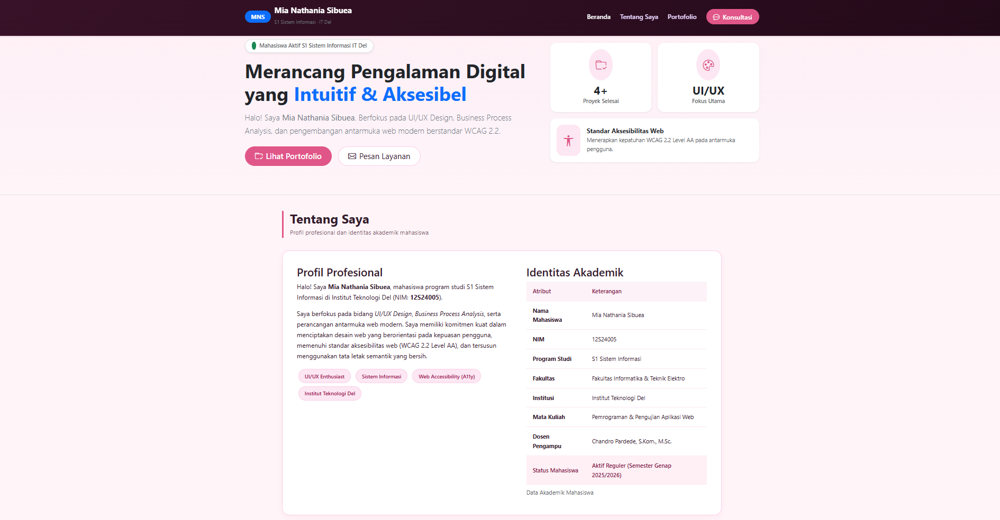
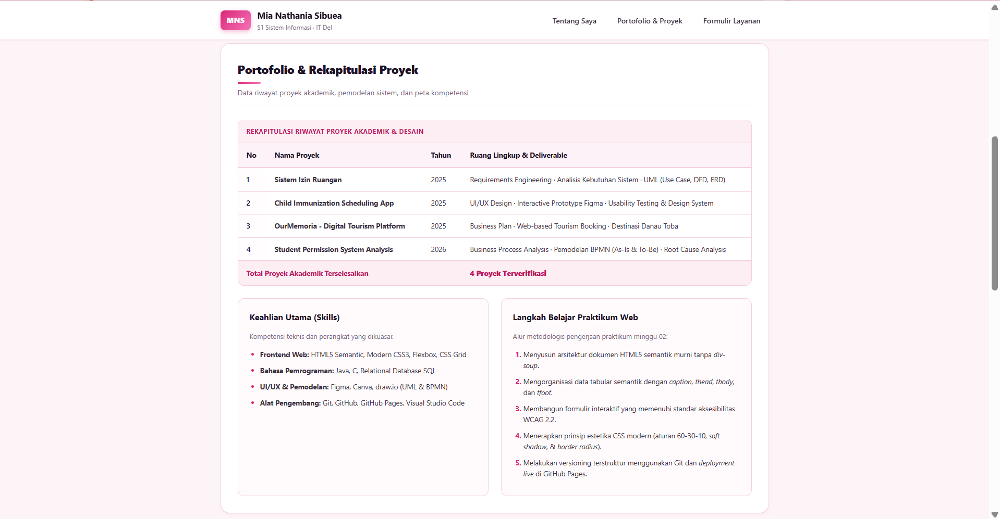
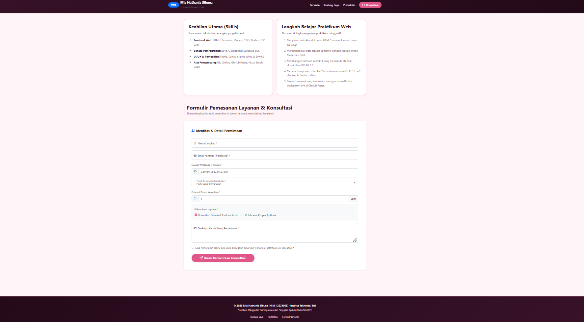

# Tugas Praktikum Minggu 03: Modernisasi & Refactoring Web Portfolio

Proyek ini merupakan hasil refactoring dan modernisasi dari tugas Minggu 02 mata kuliah **Pemrograman dan Pengujian Web (12S3101)** di **Institut Teknologi Del**. Pada praktikum minggu ini, situs web dirombak menggunakan ekosistem **Bootstrap 5.3+**, ikon **Bootstrap Icons**, dan teknik **Custom CSS Overrides & Variables** bertema personal elegan (*Soft Pink Aesthetic*).

---

## 👤 Identitas Pengembang
* **Nama Lengkap:** Mia Nathania Sibuea
* **NIM:** 12S24005
* **Program Studi:** S1 Sistem Informasi
* **Fakultas:** Fakultas Informatika dan Teknik Elektro (FITE)
* **Institusi:** Institut Teknologi Del
* **Dosen Pengampu:** Chandro Pardede, S.Kom., M.Sc.
* **Tautan Live Demo:** [Kunjungi Web Portofolio di GitHub Pages](https://miasibuea.github.io/ppw-2026-week2-12S24005/) *(sesuaikan dengan username GitHub Anda)*

---

## 📊 Tabel Komparasi: Sebelum vs Sesudah Integrasi Framework

| Area Evaluasi | Minggu 02 (Sebelum Refactoring) | Minggu 03 (Sesudah Integrasi Bootstrap 5) |
| :--- | :--- | :--- |
| **Arsitektur CSS** | CSS murni dasar, tanpa arsitektur CSS Variables. | Menerapkan $\ge$ 10 **CSS Custom Properties (`:root`)** untuk manajemen warna, tema personal *Soft Pink*, border radius, dan bayangan dinamis. |
| **Hierarki & Spesifisitas** | Penataan gaya sederhana. | Bersih dan elegan dengan **Zero `!important`**, mematuhi hierarki cascading alami dan spesifisitas selektor. |
| **Navigasi (Navbar)** | Navigasi statis berbasis CSS murni. | **Responsive Sticky-Top Navbar** lengkap dengan logo identitas *brand* dan tombol *hamburger toggle collapse* yang berfungsi mulus di layar ponsel. |
| **Hero Section** | Belum tersedia (langsung masuk ke profil). | **Hero Section Responsif Multi-Kolom** dengan headline, tombol *Call-to-Action* (CTA), dan kartu statistik portofolio (*metric cards*). |
| **Penyajian Portofolio** | Data proyek disajikan dalam bentuk tabel biasa. | **Grid Responsif 12-Kolom** (`row-cols-1 row-cols-md-2 row-cols-lg-3 g-4`) dengan 4 kartu interaktif (`.card`) dan ornamen garis animasi `::before`. |
| **Interaktivitas Detail** | Tidak ada jendela pop-up. | Terintegrasi dengan **Bootstrap Modal Dialog (`.modal`)** pada setiap kartu untuk menampilkan rincian deliverables dan lingkup proyek. |
| **Formulir Layanan** | Formulir HTML dasar dengan input standar. | **Modern Form** menggunakan komponen **Floating Labels (`.form-floating`)**, **Input Groups berikon**, pilihan radio, select topik, checkbox ketentuan, dan **validasi visual (`.was-validated`)**. |
| **Responsivitas Perangkat** | Mengandalkan media query manual dasar. | Menggunakan sistem **Bootstrap Grid 12-kolom** yang adaptif di berbagai resolusi layar (*mobile*, *tablet*, *desktop*) tanpa *horizontal overflow*. |

---

## 🛠️ Prasyarat & Teknologi yang Digunakan
1. **HTML5 Semantik:** `<header>`, `<nav>`, `<main>`, `<section>`, `<article>`, `<aside>`, `<footer>`.
2. **Bootstrap 5.3.3 CDN:** Grid system, Flexbox, Components (Navbar, Card, Modal, Form Floating).
3. **Bootstrap Icons 1.11.3 CDN:** Ikonografi visual pada tombol, form, dan kartu metrik.
4. **Advanced Custom CSS:** Variabel `:root`, pseudo-elements `::before`, transisi mikro-interaksi `transform: translateY()`.
5. **Git & GitHub Pages:** Version control terstruktur pada branch `week3-bootstrap` dan web hosting publik.

---

## 📸 Tangkapan Layar (Screenshots)

### 1. Tampilan Desktop (Navbar & Hero Section)
*(Simpan screenshot tampilan web Anda ke folder `assets/` dengan nama `desktop-hero.png`)*

### 2. Tampilan Kartu Portofolio & Modal Dialog

### 3. Tampilan Formulir Layanan Berstandar Bootstrap
